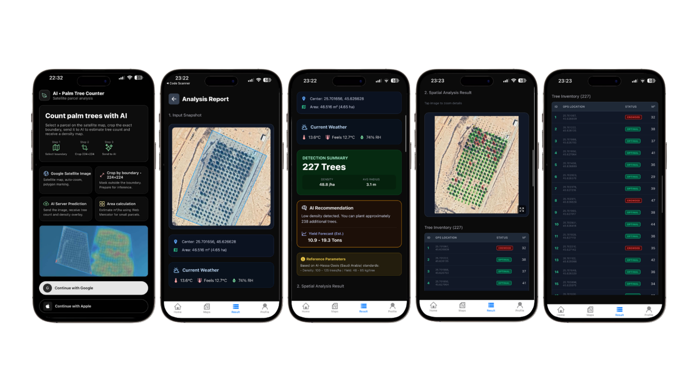
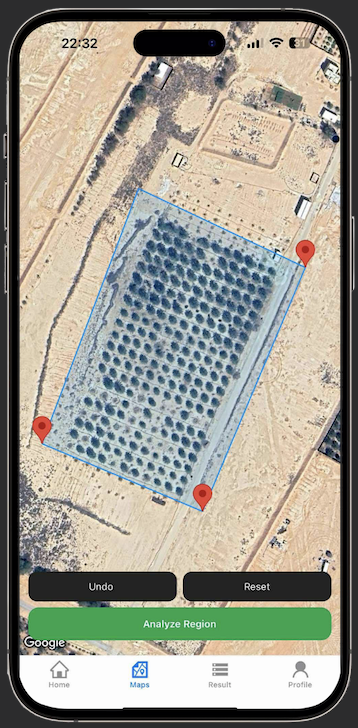
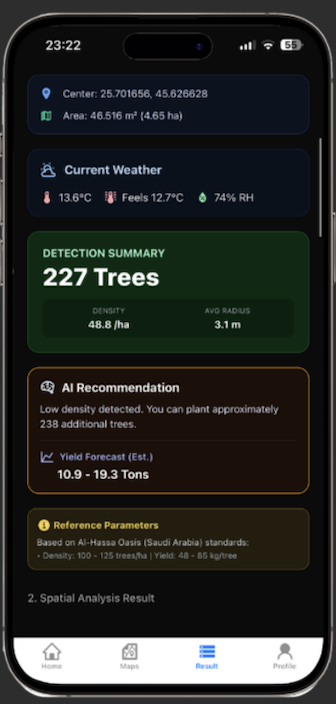
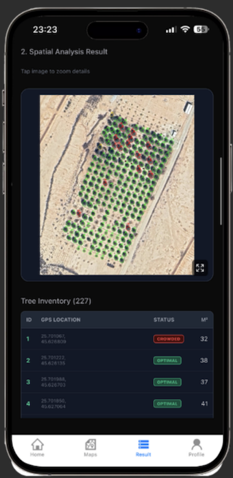

# 📱 Deep Palm Mobile: Smart Palm Tree Monitoring App


[](https://reactnative.dev/)
[](https://expo.dev/)
[](https://www.typescriptlang.org/)
[](https://expo.dev/)

## 📖 Overview

**Deep Palm Mobile** is the user-facing frontend of the Deep Palm ecosystem. This application empowers farmers and agricultural experts to interact directly with our Satellite AI engine.

Through this app, users can define farm boundaries on high-resolution satellite maps, trigger analysis requests, and receive immediate agronomic insights—including tree count, density, and health status—in a matter of seconds.

### 🚀 Key Features
* **🗺️ Interactive Satellite Maps:** Integrated Google Maps/Mapbox with high-definition satellite layers.
* **✏️ Smart Drawing Tool:** Allows users to draw precise Polygons to select specific areas for analysis.
* **⚡ Real-time Analysis:** Connects to the Deep Palm Backend to return results in **~1.7 seconds**.
* **🚦 Visual Diagnostics:** Displays an intuitive "Traffic Light" overlay (Green/Red) directly on the map to signal overcrowding or optimal spacing.
* **🆔 Digital Inventory:** detailed list of every single detected tree with exact GPS coordinates and canopy area ($m^2$).

---

## 📸 App Screenshots

| Area Selection (Drawing) | Analytics Dashboard | Health Overlay Map |
|:------------------------:|:-------------------:|:------------------:|
|  |  |  |
---

## 🛠️ Tech Stack

* **Core:** React Native, Expo Framework (Managed Workflow).
* **Language:** TypeScript.
* **State Management:** Redux Toolkit / Zustand.
* **Maps:** `react-native-maps`, `react-native-google-places-autocomplete`.
* **UI/Animation:** `react-native-reanimated`, `lottie-react-native`.
* **Networking:** Axios (communicating with FastAPI Backend).

---

## ⚙️ Installation & Setup

### Prerequisites
* Node.js (LTS version).
* Yarn or npm.
* **Expo Go** app installed on your phone or a Simulator/Emulator.

### 1. Clone the repository
```bash
git clone [https://github.com/GlowLab-IU/G-Palm]
cd deep-palm-mobile

```

### 2. Install Dependencies

```bash
yarn install
# or
npm install

```

### 3. Environment Configuration

Create a `.env` file in the root directory to store API keys and Backend URL:

```env
# AI Server URL (Local IP or Production Domain)
EXPO_PUBLIC_API_URL=[http://192.168.1.](http://192.168.1.)X:8000
# Google Maps API Key (For Android)
EXPO_PUBLIC_GOOGLE_MAPS_KEY=your_google_maps_api_key

```

### 4. Run the Application

```bash
npx expo start

```

* Scan the QR code with **Expo Go** (Android) or use the Camera app (iOS).
* Press `a` to open Android Emulator, or `i` for iOS Simulator.

---

## 📦 Build & Deploy (EAS)

This project uses **EAS Build** for production deployment.

```bash
# Install EAS CLI
npm install -g eas-cli

# Login to Expo
eas login

# Build binary (APK/IPA)
eas build -p android --profile preview
eas build -p ios --profile preview

```

---

## 🔌 API Integration

The app communicates with the Backend via the following primary endpoints:

* `POST /predict`: Sends Polygon coordinates, receives JSON results and Base64 Overlay image.
* `GET /history`: Retrieves previous scan history (if implemented).

---

## 🤝 Contributors

* **Jikey (Nguyen Nhat Truong)** - Lead Mobile & System Architect
* **Thinh (Pham Le Duc Thinh)** - AI Research & Integration Support
* **Kiet (Do Anh Kiet)** - Data Visualization

---

## 📄 License

This project is licensed under the MIT License.
